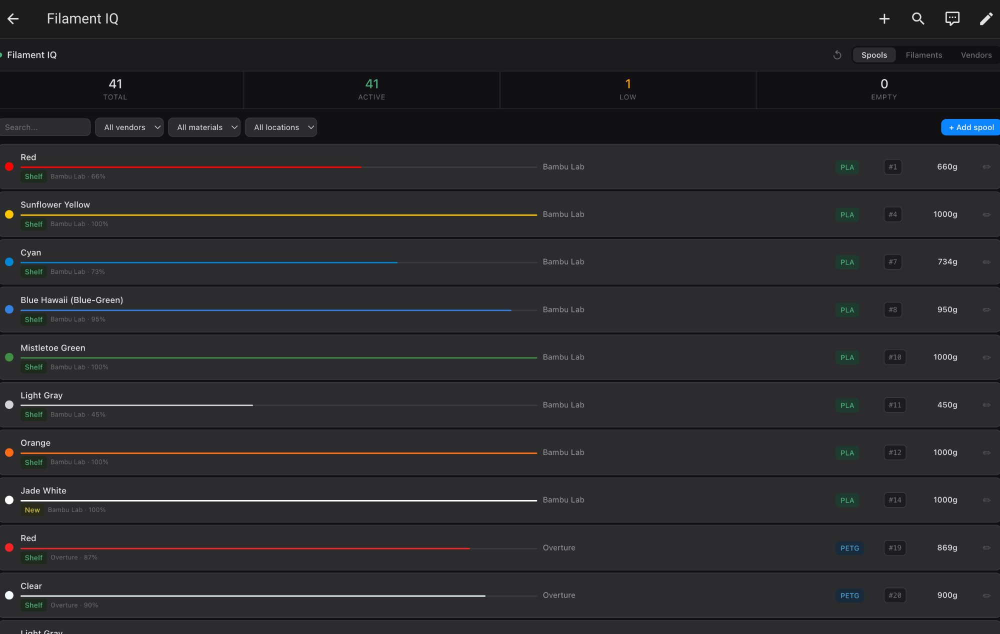
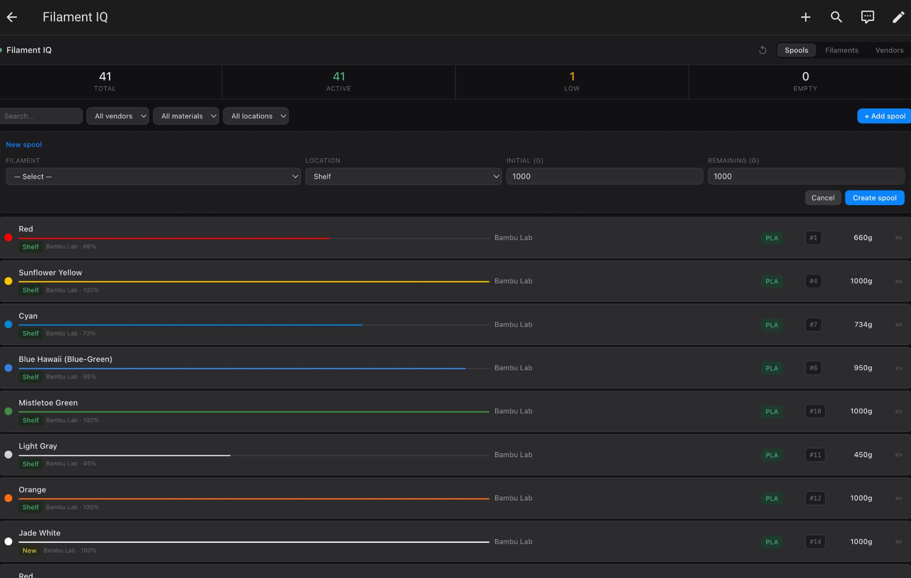
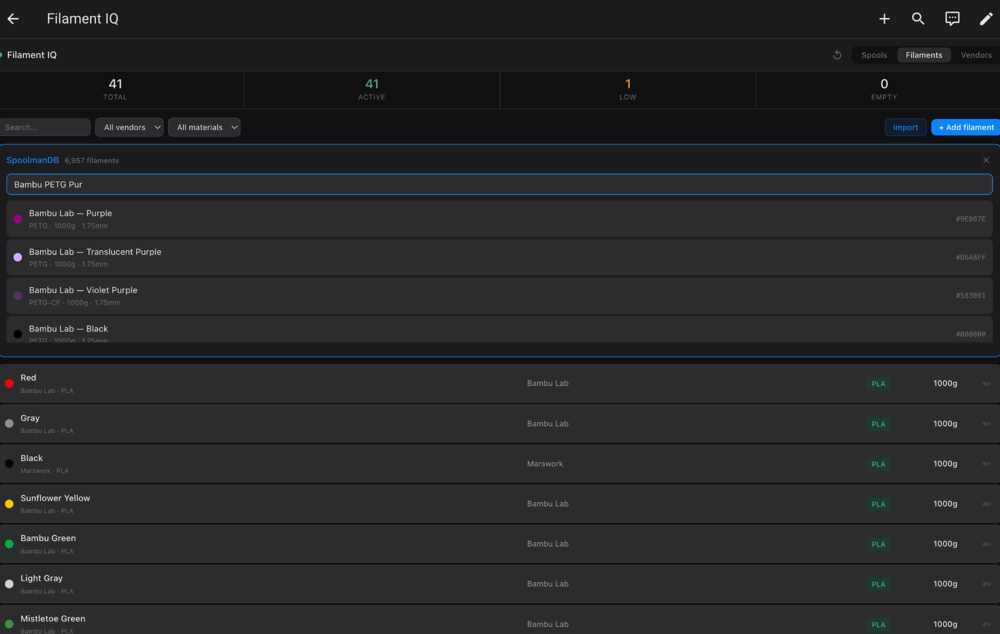
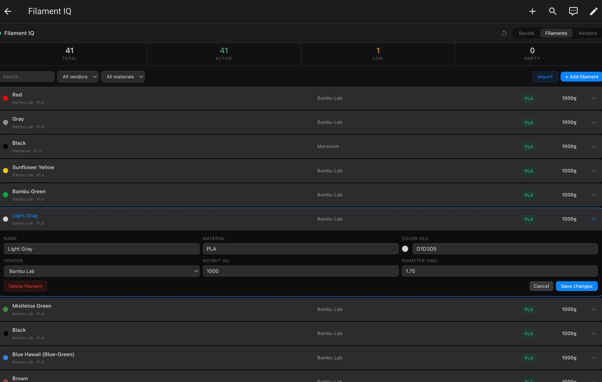
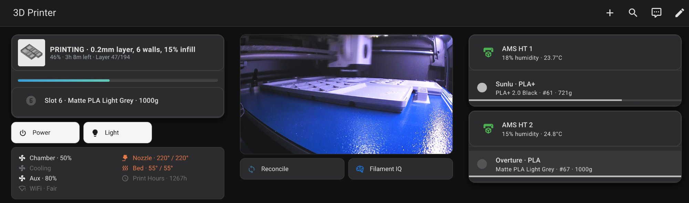

# Filament IQ

**Deterministic filament identity and lifecycle management for Bambu Lab printers with Home Assistant, AppDaemon, and Spoolman.**



## What it does

Filament IQ connects your Bambu Lab AMS to [Spoolman](https://github.com/Donkie/Spoolman) so every spool is tracked automatically. RFID spools are identified by tag. Non-RFID spools are matched by material and color. Filament consumption is recorded after every print. A custom Lovelace card gives you full spool, filament, and vendor management without leaving Home Assistant.

## Screenshots

| | |
|---|---|
|  **Spool inventory** — color dots, progress bars, material badges, location tags, search and filter toolbar |  **Add a spool** — inline form with location dropdown |
|  **SpoolmanDB import** — fuzzy search across 6,957+ filaments, auto-fills all fields |  **Edit filament** — inline editing with color preview |
|  **Printer dashboard** — live print status, camera feed, AMS slot monitoring with offline detection | |

## Features

- **Automatic filament consumption tracking** after every print via 3MF slicer data or RFID weight deltas
- **RFID spool auto-identification** — Bambu RFID tags matched to Spoolman records
- **Non-RFID matching** by material + color signature
- **Filament IQ Manager card** — full Create/Read/Update/Delete for spools, filaments, and vendors
- **SpoolmanDB import** — fuzzy search 6,957+ filaments from the community database, one-click import
- **Location tracking** — AMS slots, Shelf, New, or custom locations with colored badges
- **Smart filtering** — filter by vendor, material, location, or free-text search
- **Archive empty spools** in one tap
- **AMS offline detection** — slots show "AMS Offline" when a unit is disconnected
- **Works via Nabu Casa** — all data flows through HA's authenticated WebSocket, no ports to expose
- **AMS 2 Pro + AMS HT support** — any combination of 4-slot and 1-slot units

## Requirements

- Home Assistant 2024.1+
- [ha-bambulab](https://github.com/greghesp/ha-bambulab) integration (Bambu Lab printer integration)
- [Spoolman](https://github.com/Donkie/Spoolman) v0.19+ (filament database)
- [AppDaemon](https://github.com/AppDaemon/appdaemon) addon
- [HACS](https://hacs.xyz/) (Home Assistant Community Store)

**Required HACS frontend cards** (for the 3D Printer dashboard view):

- [mushroom](https://github.com/piitaya/lovelace-mushroom)
- [button-card](https://github.com/custom-cards/button-card)
- [card-mod](https://github.com/thomasloven/lovelace-card-mod)
- [layout-card](https://github.com/thomasloven/lovelace-layout-card)
- [browser-mod](https://github.com/thomasloven/hass-browser_mod)

> The Filament IQ Manager card itself has **no HACS dependencies**. It is a standalone Preact custom element.

## Installation

### 1. Clone the repo

```bash
git clone https://github.com/jdempsey77/filament-iq.git
cd filament-iq
```

### 2. Install AppDaemon apps

Copy the `appdaemon/apps/filament_iq/` directory to your AppDaemon apps directory:

```bash
scp -r appdaemon/apps/filament_iq/ \
  root@homeassistant.local:/addon_configs/a0d7b954_appdaemon/apps/
```

Add entries from `appdaemon/apps/apps.yaml` to your own `apps.yaml`, updating:
- `spoolman_url` to your Spoolman instance URL
- `printer_serial` to your Bambu printer serial (uppercase)
- `printer_model` to your printer model (e.g. `p1s`)

### 3. Install the proxy component

Copy `custom_components/filament_iq_proxy/` to your HA custom components:

```bash
scp -r custom_components/filament_iq_proxy/ \
  root@homeassistant.local:/config/custom_components/
```

Add to your `configuration.yaml`:

```yaml
filament_iq_proxy:
  spoolman_url: "http://localhost:7912"
```

Restart Home Assistant to load the component.

### 4. Register the Lovelace card

Copy the built card JS to your HA `www` directory:

```bash
scp packages/lovelace-card/dist/filament-iq-manager.js \
  root@homeassistant.local:/config/www/
```

In Home Assistant, go to **Settings > Dashboards > Resources > Add Resource**:
- URL: `/local/filament-iq-manager.js`
- Type: JavaScript Module

### 5. Set up the dashboard

Run the interactive setup script:

```bash
./scripts/setup-dashboard.sh
```

It will ask for your printer serial and AMS configuration (type, index, name per unit). It generates a `filament-iq-dashboard.yaml` file ready to use.

Copy the generated file to your HA config directory and add to `configuration.yaml`:

```yaml
lovelace:
  dashboards:
    filament-iq:
      mode: yaml
      title: Filament IQ
      icon: mdi:brain
      filename: filament-iq-dashboard.yaml
```

Restart Home Assistant.

## AMS Configuration

The setup script supports any combination of AMS units. Common configurations:

| Unit | Slots | HA sensor prefix | ams_index |
|------|-------|------------------|-----------|
| AMS Pro/Lite (first) | 1-4 | `ams_0_` | 0 |
| AMS Pro/Lite (second) | 5-8 | `ams_1_` | 1 |
| AMS HT (first) | varies | `ams_128_` | 128 |
| AMS HT (second) | varies | `ams_129_` | 129 |

Find your AMS indices in HA: **Developer Tools > States** and search for `ams_`. The number in `sensor.p1s_XXXXX_ams_NUMBER_humidity` is your AMS index.

## Using the card

### Spools tab
Full spool inventory with color dots, progress bars, material badges, and location tags. Click any row to expand the inline edit panel. Use the toolbar to search or filter by vendor, material, or location.

### Filaments tab
View and edit all filament definitions. Click **Import** to open SpoolmanDB fuzzy search — type a query like `bambu red pla` or `overture petg gray` and pick a result. All fields (density, diameter, weight, temperatures) are pre-filled. The vendor is auto-matched or created on import.

### Vendors tab
Add and edit filament vendors. Vendor count shows how many filaments reference each vendor.

## Troubleshooting

**Card shows "Loading..." permanently**
The `filament_iq_proxy` component is not loaded. Verify it appears in HA: Developer Tools > Services > search for `filament_iq_proxy.api_call`. If missing, check that the component files are in `/config/custom_components/filament_iq_proxy/` and that `filament_iq_proxy:` is in your `configuration.yaml`. Restart HA after installing.

**"Too Generic to auto-match" on a slot**
A non-RFID spool matches multiple entries in Spoolman with the same material and color. Tap the slot card to manually select the correct spool. This is expected behavior.

**SpoolmanDB import shows no results**
The database loads on first open (6,957 entries). Wait for "Loading database..." to finish, then search. Use specific multi-word queries: `bambu red pla` works better than just `red`.

**"Configuration error" on custom cards**
HACS cards are missing or resource URLs are incorrect. Verify all required HACS cards are installed. Check **Settings > Dashboards > Resources** for correct paths.

**AMS slots show "AMS Offline"**
The AMS unit's humidity sensor is unavailable. Check the physical connection between the AMS and printer. The slot cards will recover automatically when the AMS reconnects.

## Architecture

```
Bambu Lab Printer (MQTT)
       |
       v
ha-bambulab integration (HA entities)
       |
       v
AppDaemon / filament_iq apps
       |  urllib (HTTP)
       v
Spoolman (filament database)
       |  REST API
       v
filament_iq_proxy (HA custom component)
       |  HA WebSocket + events
       v
filament-iq-manager (Preact Lovelace card)
```

**Data flow:**
1. Bambu printer publishes state via MQTT
2. ha-bambulab creates HA entities (tray status, print progress, etc.)
3. AppDaemon apps monitor print lifecycle, match spools, record consumption
4. Spoolman stores all filament/spool data via REST API
5. The custom component proxies browser requests to Spoolman through HA's WebSocket
6. The Preact card renders the UI and calls the proxy for all CRUD operations

## License

MIT
